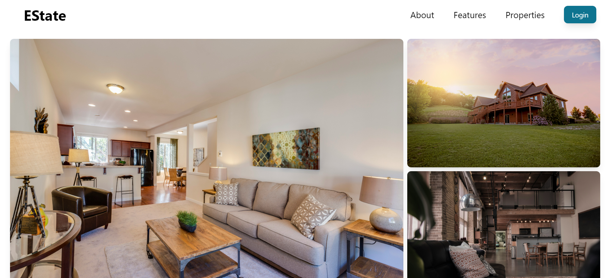
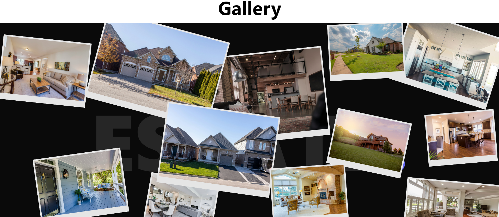
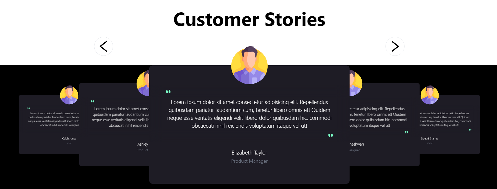
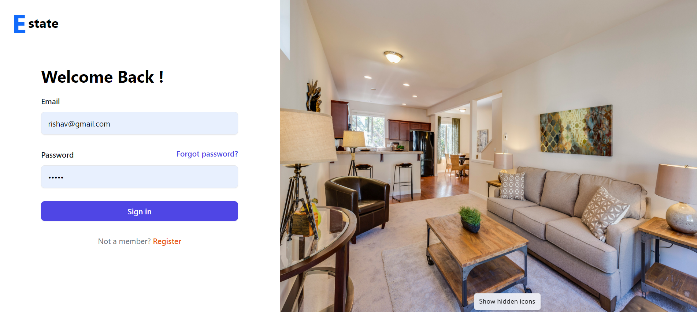
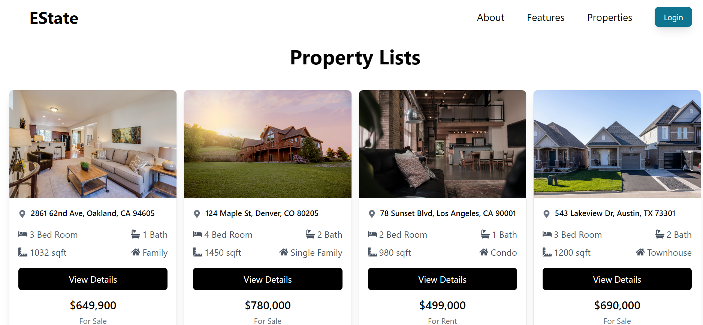
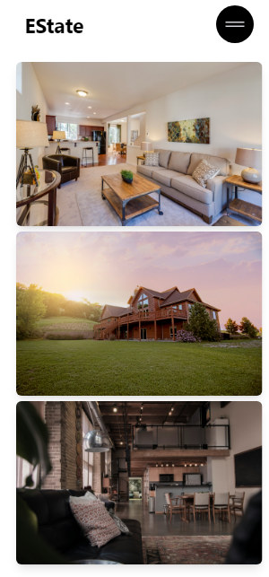
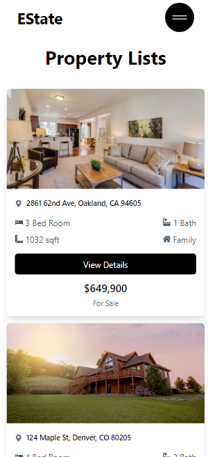

# Estate Website - Frontend

This is the frontend of the Estate Website built using React, Tailwind CSS, and modern web technologies.

## Table of Contents
- [Features](#features)
- [Screenshots](#screenshots)
- [Installation](#installation)
- [Usage](#usage)
- [Technologies](#technologies)

## Features
- Property listings (category, price, location)
- Responsive design for various screen sizes
- Detailed property pages with images and descriptions
- User authentication
- Interactive UI components using React

## Screenshots

### Homepage


### Property List Page


### Property List Page


### Property List Page


### Property List Page


### Responsive



## Installation

To get the frontend up and running locally, follow these steps.

### Prerequisites

Make sure you have the following installed on your machine:

- [Node.js](https://nodejs.org/en/) (version 14 or higher)
- [Git](https://git-scm.com/)

### Steps

1. Clone the repository:
   ```bash
   git clone https://github.com/yourusername/estate-frontend.git

2. **Vite Setup**: The project is initialized with Vite using `npm create vite@latest <project-name> --template react`.
   
3. **Tailwind CSS Setup**: Tailwind is installed and configured with `npm install -D tailwindcss postcss autoprefixer`, and necessary configuration is added in `tailwind.config.js` and `index.css`.
   
4. **Development and Build Commands**: `npm run dev` for development and `npm run build` for production builds.


